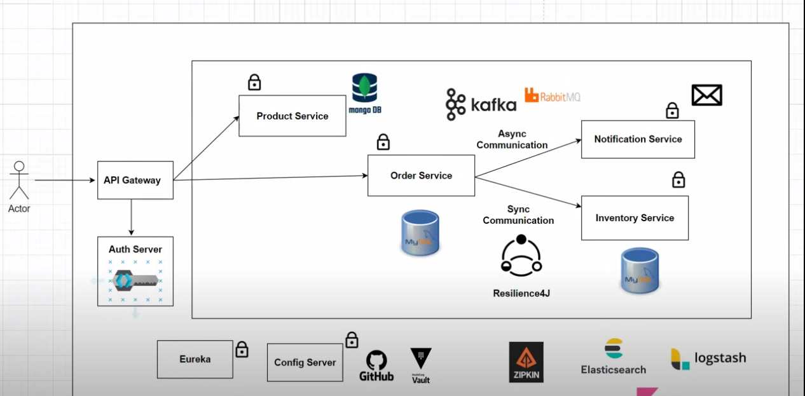
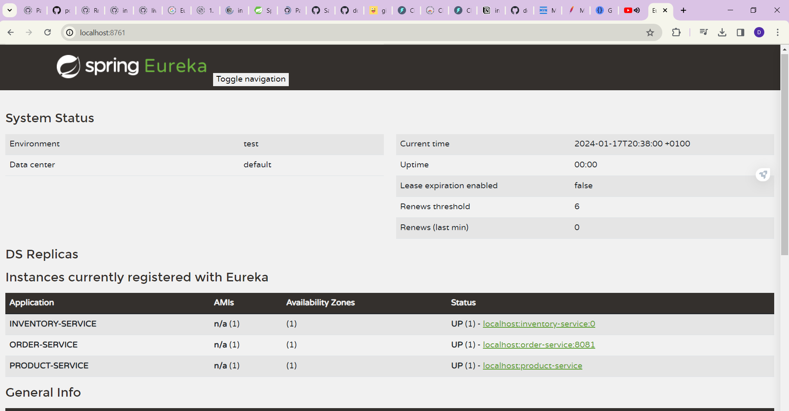
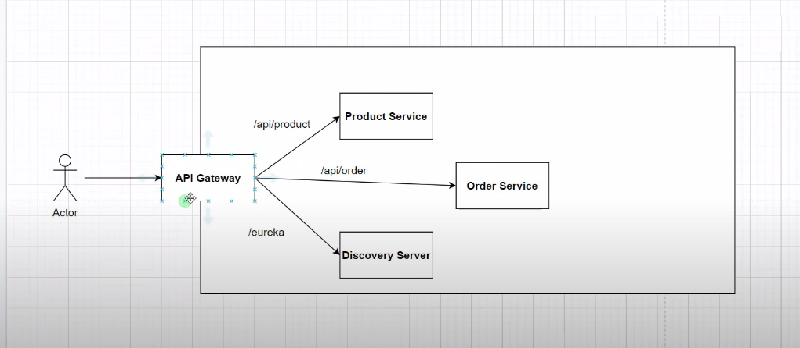
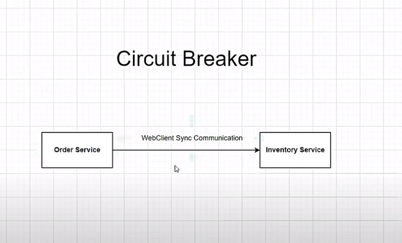
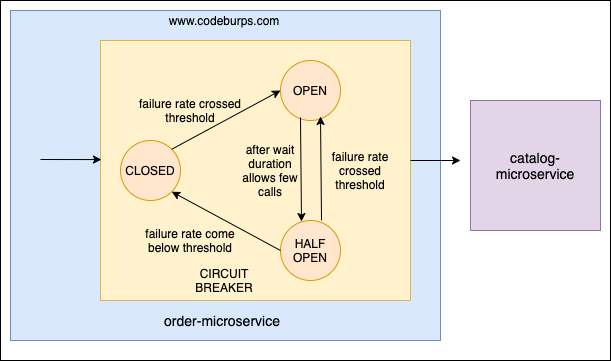
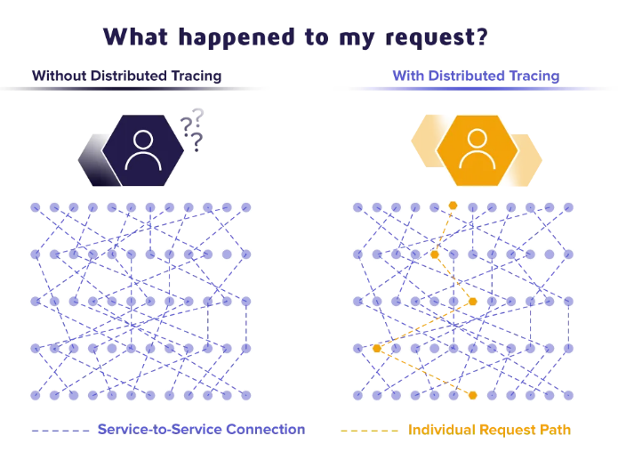

# Spring Boot Project Setup Mini-Project

## Introduction
Welcome to the Spring Boot Project Setup Mini-Project. This project is designed to introduce you to the challenges and steps involved in setting up a new Spring Boot project, including installing dependencies and developing a basic application.

## Objectives
- Understand the structure of a Spring Boot project.
- Learn how to set up a Spring Boot project from scratch.
- Explore how to add and manage dependencies.
- Develop a basic Spring Boot application.

## Getting Started
### Prerequisites
- JDK 1.8 or later
- Maven 3.2+

### Setting Up the Project
1. **Create a Spring Boot Project:**
   - Use [Spring Initializr](https://start.spring.io/) to generate your project structure.
   - Choose your preferred dependencies and download the project.

2. **Import the Project:**
   - Open your IDE (e.g., IntelliJ IDEA, Eclipse) and import the project as a Maven project.

3. **Explore the Project Structure:**
   - Familiarize yourself with the standard Spring Boot project layout.

### Installing Dependencies
- Add any additional dependencies you need in the `pom.xml` file.
- Use Maven commands to install and manage these dependencies.

## Development
- Start by editing the `Application.java` file to create your first simple REST endpoint.
- Explore how to configure your application using `application.properties` or `application.yml`.

## Running the Application
- Run the application from your IDE or use the command line: `mvn spring-boot:run`.
- Access the REST endpoints you have created.

## Conclusion
This mini-project is a hands-on guide to setting up and developing a Spring Boot application. Through this exercise, you will gain a better understanding of the Spring Boot framework and its capabilities.

## Resources
- [Spring Boot Documentation](https://docs.spring.io/spring-boot/docs/current/reference/html/)
- [Spring Framework Guides](https://spring.io/guides)

# PART1: Building Services



In this section, we'll explore the fundamental concepts and annotations used for building services with Spring Boot. We'll discuss key annotations, project setup using Maven, and an overview of building Spring Boot applications.

## What I've Learned

### Spring Boot Application Setup
1. `@SpringBootApplication`: Marks the main class of a Spring Boot application and enables auto-configuration and component scanning.
2. Project setup using [https://start.spring.io/](https://start.spring.io/): This web-based tool helps create a Maven project with the necessary dependencies and configurations for Spring Boot applications.

# What You Can Learn from Building Services

## 1. Microservices Architecture
   - Understand the principles of designing applications as a set of small, independent, and loosely coupled services.

## 2. Spring Boot
   - Learn how to use Spring Boot, a popular framework for building Java-based microservices, and its features for rapid development.

## 3. RESTful API Development
   - Gain expertise in creating RESTful APIs that expose your service's functionalities to clients.

## 4. Database Interactions
   - Learn how to interact with databases using Spring Data JPA or other persistence technologies to store and retrieve data.

## 5. Dependency Injection
   - Understand how to manage dependencies and perform dependency injection in Spring Boot applications.

## 6. Service Configuration
   - Learn how to configure your services using properties, YAML files, environment variables, and configuration classes.


### Annotation Essentials
```java
3. @RestController: Indicates that a class is a RESTful controller, handling HTTP requests and returning responses.
4. @RequestMapping: Maps HTTP requests to controller methods and specifies the request path.
5. @Autowired: Injects dependencies, such as beans or services, into a class or constructor.
6. @Service: Indicates that a class is a service component, typically containing business logic.
7. @Repository: Marks a class as a repository, often used for database operations with Spring Data.
8. @Component: Marks a class as a Spring component, allowing it to be automatically discovered and managed by the Spring container.
9. @Configuration: Identifies a class as a configuration class for defining beans and configurations.
10. @Value: Injects values from properties files or configuration into fields or method parameters.
11. @Profile: Specifies which profiles should activate a particular component or configuration.
12. @EnableAutoConfiguration: Enables Spring Boot's automatic configuration based on classpath dependencies.
13. @Entity: Declares a class as a JPA entity, representing a database table.
14. @Table: Defines the database table associated with a JPA entity.
15. @Id: Marks a field as the primary key in a JPA entity.
16. @Column: Maps a field to a database column in a JPA entity.
17. @OneToMany and @ManyToOne: Define relationships between JPA entities for one-to-many and many-to-one associations.
18. @GetMapping, @PostMapping, @PutMapping, @DeleteMapping: Specify HTTP request methods in controller methods.
19. @ExceptionHandler: Handles exceptions globally in a Spring MVC application.
20. @Transactional: Specifies transactional behavior for methods in a service or repository.
21. @Valid: Indicates that a parameter should be validated using Bean Validation (JSR-303).
22. @Bean: Marks a method as a Spring bean factory, allowing custom bean creation and configuration within a Spring application context.
```

# Project Structure and Configuration

## `pom.xml` - The Heart of Your Project

The `pom.xml` file, also known as the Project Object Model, is a critical component of Maven-based Java projects. It serves several essential roles in managing your project:

1. **Project Configuration**: The `pom.xml` file defines key project information, such as its name, version, and description. It ensures clarity and uniqueness in project identification.

2. **Project Dependencies**: You can list external libraries and components that your project relies on within the `pom.xml`. Maven then automatically manages and downloads these dependencies, simplifying project setup and ensuring consistency across development environments.

3. **Build Lifecycle Configuration**: The `pom.xml` specifies how your project is built and packaged. It outlines build phases (e.g., compilation, testing, packaging) and utilizes plugins with their configurations to execute these tasks. This automation streamlines the development process.

In summary, the `pom.xml` file is fundamental to your Maven-based project. It streamlines project configuration, simplifies dependency management, and automates the build process, making it a crucial tool for Java developers.

# PART2: Inter-Process Communication

In this section, I'll delve into the crucial topic of inter-process communication (IPC) within a microservices architecture. IPC plays a pivotal role in enabling communication and collaboration between microservices to create a cohesive and functional system.

Here, I have gained insights into various IPC mechanisms, including:

- **HTTP/REST**:  
- **Message Queues**: Using message brokers like RabbitMQ, Kafka, or ActiveMQ for asynchronous messaging between microservices.
- **Service Discovery**: Understanding how service discovery tools like Eureka or Consul assist in locating and connecting with other services.
- **API Gateways**: Exploring the role of API gateways in managing and routing requests to the appropriate microservices.

Additionally, I've delved deeper into two essential tools for HTTP-based communication:

- **RestTemplate**: This classic Spring Framework tool allows for making HTTP requests to other services in a synchronous manner. It simplifies REST API consumption and data exchange.

- **WebClient**: Introduced in Spring WebFlux, `WebClient` provides a non-blocking and reactive way to interact with external services. It's especially valuable for asynchronous and reactive microservices.

By the end of this section, I've gained a comprehensive understanding of various IPC mechanisms, including how to effectively use `RestTemplate` and `WebClient` for inter-service communication in a microservices ecosystem.

### Inter-Service Communication between OrderService and InventoryService

- **WebClient Configuration**: `WebClientConfig` class provides a load-balanced `WebClient.Builder` bean for making HTTP requests.

    ```java
    @Configuration
    public class WebClientConfig {
        @Bean
        @LoadBalanced
        public WebClient.Builder webClientBuilder() {
            return WebClient.builder();
        }
    }
    ```

- **OrderService Implementation**: Handles order requests by communicating with the `InventoryService` to check product availability. It maps order line items, collects SKU codes, and queries the `InventoryService`. If all products are in stock, the order is processed; otherwise, an exception is thrown.

    ```java
    public class OrderService {
        // ... (dependencies and constructor)

        public void placeOrder(OrderRequest orderRequest) {
            // Logic to process the order
            // Communicates with InventoryService using WebClient
            // Saves order if products are in stock
        }

        // Additional private methods
    }
    ```

This setup demonstrates effective use of `RestTemplate` and `WebClient` for inter-service communication in a microservices architecture.

## PART 3: Service Discovery using Netflix Eureka

### Problem Statement

In a microservices architecture, inter-process communication (IPC) is crucial for various services to communicate with each other. However, in a cloud environment, everything is dynamic, and services cannot rely on dedicated IP addresses. Microservices can run on different ports, and their locations may change due to scaling, load balancing, or failures. This dynamic nature of microservices deployment makes it challenging to establish direct communication between services. For example, an API Gateway cannot make assumptions about the IP address or port of an inventory service, as there can be multiple instances of the service running simultaneously.

### Service Discovery Pattern

To address these challenges, the Service Discovery pattern comes into play. Service Discovery is a pattern used in microservices architecture to dynamically locate and call the available instances of a service, regardless of their IP addresses and port numbers. It allows services to find and communicate with each other seamlessly, even in a dynamic and constantly changing environment.

### Netflix Eureka

Netflix Eureka is a popular and widely used service discovery tool that helps microservices register themselves and discover other services within a cloud-based or containerized environment. It acts as a service registry that maintains a dynamic list of available services and their instances. When a service wants to communicate with another service, it queries Eureka to find the location (IP address and port) of the desired service instance.

#### How Eureka Works

1. **Service Registration**: Microservices register themselves with Eureka when they start up. They provide metadata such as service name, version, and instance location.

2. **Heartbeats**: Registered services send regular heartbeats to Eureka to indicate that they are alive and operational. Eureka monitors these heartbeats to track the health of services.

3. **Service Discovery**: When a service needs to communicate with another service, it queries Eureka for the available instances of that service. Eureka returns a list of instances, and the calling service can choose one to communicate with.

4. **Load Balancing**: Eureka can be integrated with load balancers to distribute incoming requests evenly across multiple service instances.

### Benefits of Netflix Eureka

- **Dynamic Service Discovery**: Eureka allows services to discover each other dynamically, regardless of their changing IP addresses and ports.

- **Load Balancing**: Eureka can be used in conjunction with load balancers to distribute traffic evenly among service instances, improving performance and scalability.

- **High Availability**: Eureka itself can be designed for high availability, ensuring that service discovery remains robust even in the presence of failures.

- **Efficient Routing**: Services can efficiently route requests to the closest or healthiest instances, optimizing response times.

By adopting the Service Discovery pattern using Netflix Eureka, microservices can operate more effectively in dynamic, cloud-based environments, ensuring seamless communication and scalability.



In the "Instances currently registered with Eureka" section, three microservices are listed: "INVENTORY-SERVICE", "ORDER-SERVICE", and "PRODUCT-SERVICE". Each service has a status of "UP", indicating they are currently running and properly registered with Eureka. The services are running on different ports as indicated by the URLs shown (e.g., "localhost:inventory-service:0", "localhost:order-service:8081", and "localhost:product-service").

This screen is typically used by developers and system administrators to monitor the status of microservices and their instances in a distributed system.


# Client-Side Load Balancing

Client-side load balancing is a technique where the client, rather than a centralized load balancer, is responsible for distributing the load across multiple server instances. In the context of microservices and service discovery (like with Spring Eureka), client-side load balancing can work as follows:

## Service Discovery
The client first queries a service registry, such as Eureka, to get a list of available service instances. The registry contains the network locations of the instances of various services that are running in the microservices environment.

## Load Balancing Decision
Instead of having a server-side load balancer distribute requests, the client uses a load-balancing algorithm to select which service instance to send a request to. This decision is made at runtime, for each request.

## Request Routing
The client then sends the request directly to the chosen instance.

# Conclusion : Service Discovery with Netflix Eureka
Service Discovery with Netflix Eureka allows clients to dynamically discover and locate services in a microservices architecture.

## PART 4: Implement API Gateway using Spring Cloud Gateway



### First Question

# Spring Cloud Gateway ?

an API Gateway on top of Spring WebFlux or Spring WebMVC. Spring Cloud Gateway aims to provide a simple, yet effective way to route to APIs and provide cross cutting concerns to them such as: security, monitoring/metrics, and resiliency.


# Part 5: Secure Microservices using Keycloak

## Introduction to Keycloak
Keycloak is an open-source solution for Identity and Access Management, designed for modern applications. It simplifies securing applications and services with minimal coding.

## Why Use Keycloak?
- **Centralized User Management**: Manage user identities and control access from a single point.
- **Standards-Based**: Supports OpenID Connect, OAuth 2.0, SAML 2.0 for wide compatibility.
- **Single Sign-On (SSO)**: Enables users to log in once for multiple applications.
- **Social Login**: Supports login via platforms like Google, Facebook, LinkedIn.
- **Fine-Grained Authorization**: Define detailed access policies and permissions.
- **Customizable**: Offers customizable interfaces for user interactions.
- **Robust Security Features**: Includes password policies, brute-force detection, and 2-factor authentication.
- **Ease of Deployment**: Easily deployable in various environments, compatible with Docker and Kubernetes.

## Key Features
- **User Federation**: Integrates with external directories like LDAP and Active Directory.
- **Identity Brokering**: Connects with other identity providers.
- **Client Adapters**: Simplifies integration with various application types.
- **Admin Console**: A web-based interface for managing users and permissions.

Keycloak is ideal for securing microservices, offering extensive features and seamless integration with Spring Security and Spring Cloud Gateway.

## PART 6: Implement Circuit Breaker in Spring Boot



### Introduction to Circuit Breaker in Spring Boot
In a microservices architecture, services often depend on each other. Implementing a Circuit Breaker pattern in Spring Boot addresses issues related to service dependencies, improving system resilience and stability.

### Why Implement Circuit Breaker in Spring Boot?
- **Prevent Failures from Cascading**: Stops repeated calls to a failing service, minimizing the impact of failures.
- **Service Fallback Mechanisms**: Provides alternatives when a service fails, enhancing user experience.
- **Resilience and Stability**: Maintains system stability during partial outages.
- **Real-Time Monitoring and Recovery**: Monitors service health, automatically restoring operations when possible.
- **Efficient Resource Utilization**: Reduces load by avoiding calls to problematic areas.

### Key Features
- **Spring Cloud Integration**: Works seamlessly with Spring Cloud components.
- **Customizable Thresholds**: Set parameters for failure detection and circuit opening.
- **Real-Time Metrics**: Insights into service performance and circuit status.
- **Annotation-Driven Configuration**: Easy configuration using annotations like `@CircuitBreaker`.

Implementing a Circuit Breaker ensures our microservices handle failures gracefully, providing reliability and enhanced user experience.

## Resilience4j Overview ? 

Resilience4j is a lightweight fault tolerance library inspired by Netflix's Hystrix, but designed for Java 8 and functional programming. It offers several core modules, such as Retry, Circuit Breaker, Rate Limiter, Time Limiter, and Bulkhead, each of which can be used in isolation or together. Resilience4j allows developers to build highly resilient and robust applications that can gracefully handle external system failures. Its lightweight nature and modular design make it a great choice for microservice architectures where network-based service-to-service communication is common.

Key Features:
- **Circuit Breaker**: Helps in preventing a cascade of failures when a remote service is down.
- **Rate Limiter**: Limits the number of times a service can be called within a certain period.
- **Retry**: Provides the ability to automatically retry a failed call.
- **Bulkhead**: Limits the number of concurrent calls to a component.
- **Time Limiter**: Sets time limits for a call to complete.

Resilience4j is a versatile library and integrates well with Spring Boot, making it a popular choice for building resilient Java applications.

## Circuit Breaker Functionality

The circuit breaker pattern is a crucial part of building resilient applications, especially in microservices architectures. Here's how a circuit breaker functions:

- **Detection of Errors**: If a circuit breaker detects a high number of errors, it will "open" its circuit, preventing new calls to the failing service.

- **Open Circuit State**: When the circuit is "open," it doesn't wait for new errors to occur on subsequent calls. Instead, it immediately redirects the call to a predefined fallback method.

- **Fallback Method**: The fallback method can return a response from a "cache" or simply return a pre-defined error message, mitigating the impact of the failing service.

- **Half-Open State**: After a configurable period, the circuit breaker enters a "half-open" state. In this state, a limited number of test calls are allowed to pass through to determine if the underlying issue has been resolved.

- **Evaluation of Service Health**: If these test calls fail, the circuit breaker reverts to the "open" state, continuing to redirect calls to the fallback method. If the calls succeed, it indicates that the issue has been resolved, and the circuit breaker transitions to the "closed" state, resuming normal operations.

This pattern helps prevent a failing service from causing a cascading failure in other parts of the application.




## PART 7: Implement Distributed Tracing



### What is Distributed Tracing?

In a Microservices architecture, a request can travel across multiple microservices to build the response and send it to the user. Pinpointing issues in such an environment can be challenging. Distributed Tracing is designed to tackle this problem.

Distributed Tracing traces every single request from its origin through all the services it interacts with. It involves analyzing data associated with each request, including a Trace ID, timestamp, and other useful metadata. This approach allows us to track how long a request takes in each microservice and gather metrics to improve latency and overall system performance.


*Image Credit: Jaeger Tracing*

### Benefits of Distributed Tracing

- **End-to-End Visibility**: Gain a complete view of user requests as they travel through the entire system of microservices.
- **Service Dependencies Information**: Understand how different services are interconnected and dependent on each other.
- **Metrics and Observability**: Collect valuable data to monitor the health and performance of your microservices.
- **Resiliency in Failure Scenarios**: Improve the system's ability to remain robust in the face of failures by quickly identifying and addressing issues.
